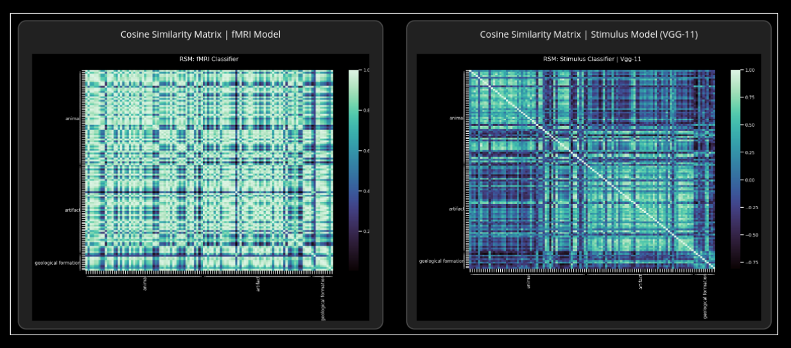

# Decoding Thoughts

[](https://github.com/theairbend3r/decoding-thoughts/actions/workflows/gh-actions-ci.yml) [](https://codecov.io/gh/theairbend3r/decoding-thoughts)   [](https://decoding-thoughts.readthedocs.io/en/latest/?badge=latest)

Decoding visual stimulus from brain fMRI data and comparing its learned representations with ones decoded by convolutional neural networks using methods from computational neuroscience and deep learning.



## Installation

Clone the repository.

```
git clone https://github.com/theairbend3r/decoding-thoughts.git
```

Create environment.

```
conda env create -f environment.yml
```

Install packages.

```
pip install -r requirements.txt
```

## Content

The main package resides in `./src/`.

Jupyter notebooks that use modules from the above package are in `./notebooks/`.

1. Exploratory Analysis
2. Stimulus Classifier
3. fMRI Classifier
4. Representational Similarity Matrix and Robustness

## Experiment and Analysis

### Goal

- Study the robustness of CNN models to increasing noise and compare the similarity of its learned embeddings to brain's representation of the same visual stimulus.

### Hypothesis

- Latent representations generated by the most robust CNN (Stimulus) model may be closest to the one generated by the DNN (fMRI/Brain) model.

### Dataset

- The kay dataset (Kay et. al., 2008) contains images and the corresponding brain fMRI readings collected from 2 human subjects who were shown a set of natural images while their brain activity was being recorded.
- Data shapes:
  - fMRI: 8428 voxels
  - Images: (128 x 128) pixels

### Method

- Train a 3 layer DNN to predict output labels using fMRI data.
- Finetune 5 CNNs (pretrained on ImageNet) to predict output labels using images.
- Extract embeddings for all images in test set from the trained models (CNN and DNN).
- Perform representation similarity analysis using cosine-similarity metric for each model using its learned embeddings.
- Add increasing levels of gaussian blurring to the images as they are passed through these networks and capture the accuracy.
- Compute the correlation between the representational similary matrix (RSM) (computed above) for fMRI (DNN) vs Stimulus (CNN1, CNN2, ..., CNN5) models.
- Observe the relationship between correlation coefficients calculated betwee RSMs (fMRI vs Stimulus) and the CNN model (Stimulus) that drops the most accuracy for noisy input.

### Results

- See notebooks in the `./notebooks/` directory.

## Meta

Akshaj Verma – [@theairbend3r](https://twitter.com/theairbend3r)

Distributed under the GNU GPL-V3 license. See LICENSE for more information.

https://github.com/theairbend3r/decoding-thoughts
